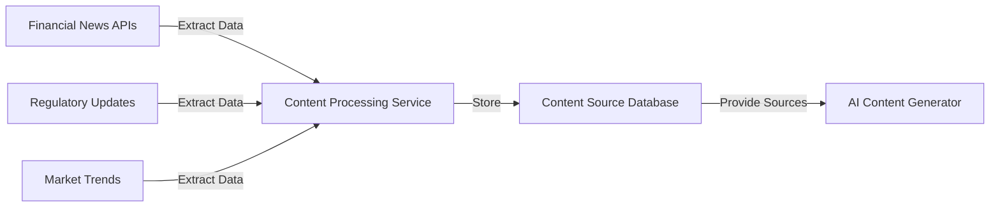
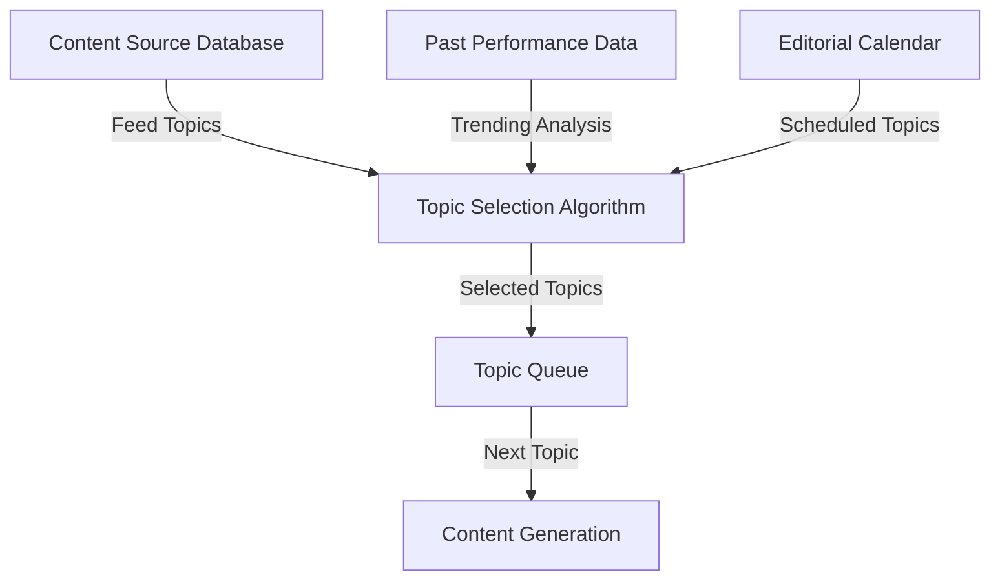
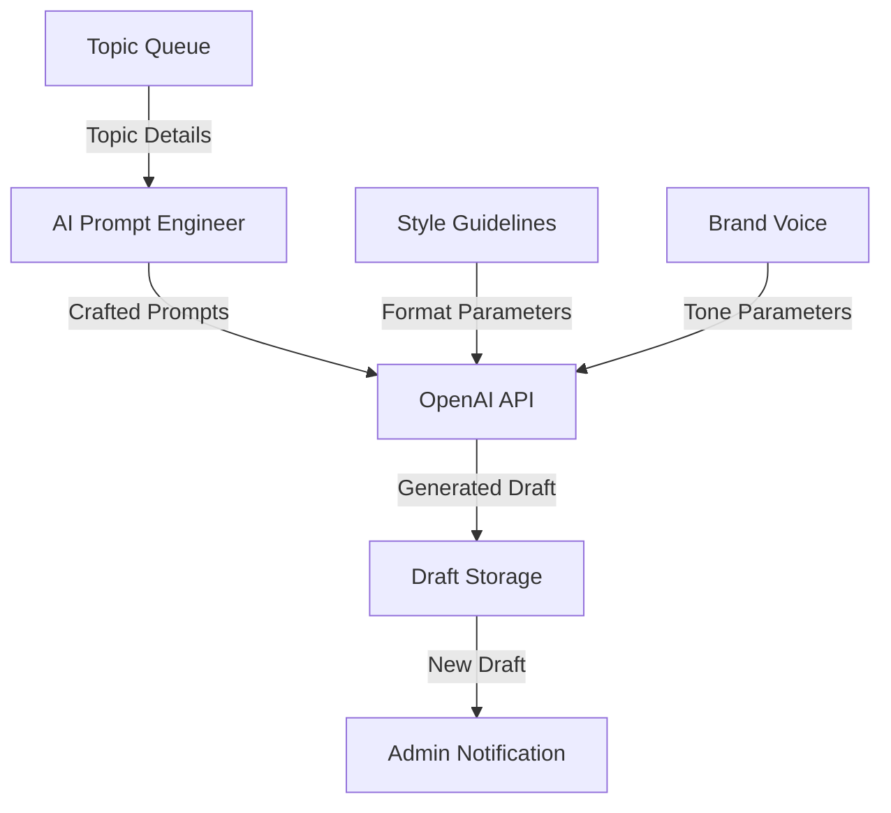
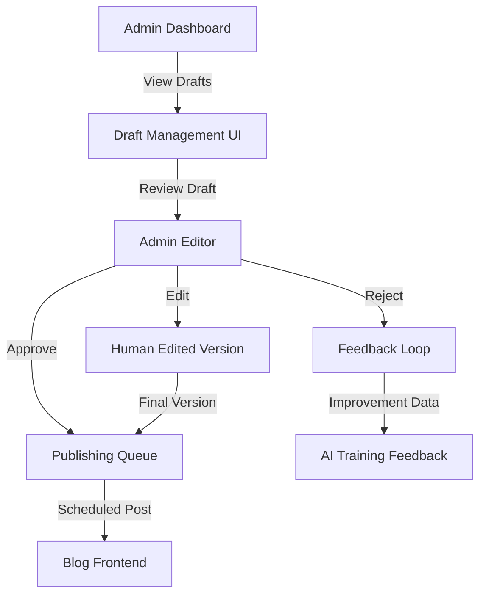
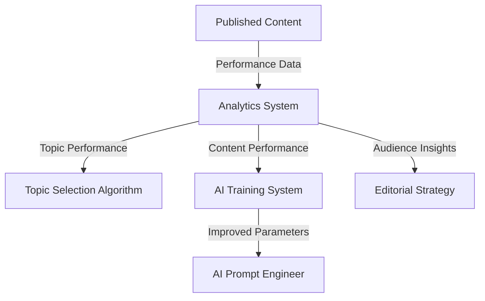

# AI Content Generation Workflow

This document outlines the workflow for the AI-powered blog content generation system.

## Overview

The AI content generation system will automate the creation of high-quality financial blog posts by leveraging external news sources, industry data, and advanced AI language models.

## Workflow Stages

### 1. Content Source Integration



#### Implementation Details:

- **Source APIs**: Alpha Vantage, Financial Times, SEC EDGAR
- **Extraction Frequency**: Daily automated fetching
- **Data Processing**: NLP-based entity and topic extraction
- **Storage**: PostgreSQL with vector embeddings for semantic search

### 2. Topic Selection & Planning



#### Implementation Details:

- **Selection Criteria**: Relevance, timeliness, engagement potential
- **Performance Analysis**: Review of previous related content metrics
- **Editorial Planning**: Integration with content calendar system
- **Queue Management**: Priority-based topic scheduling

### 3. Content Generation



#### Implementation Details:

- **AI Provider**: OpenAI GPT-4 or equivalent
- **Prompt Engineering**: Specialized financial content prompts
- **Quality Parameters**: Min/max length, citation requirements, technical depth
- **Draft Format**: HTML with metadata (category, tags, SEO fields)

### 4. Admin Review & Publishing



#### Implementation Details:

- **Review Interface**: Admin dashboard with AI-draft specific tab
- **Quality Indicators**: Readability score, uniqueness score, fact-check status
- **Edit Interface**: Rich text editor with version comparison
- **Feedback System**: Structured feedback categories to improve future generations

### 5. Performance Analytics & Learning



#### Implementation Details:

- **Performance Metrics**: Views, engagement time, shares, comments
- **Content Attribution**: Human vs. AI vs. hybrid authorship tracking
- **Feedback Collection**: Reader feedback mechanisms
- **Continuous Learning**: Systematically incorporate performance data into future generation

## Technical Implementation Plan

### Phase 1: Foundation (Weeks 1-2)

- Set up Python service with PostgreSQL connection
- Implement news API integrations
- Create content storage schema and APIs
- Build topic extraction and analysis system

### Phase 2: Generation Pipeline (Weeks 3-4)

- Implement OpenAI integration
- Develop prompt engineering system
- Create draft storage and admin notification
- Build basic admin review interface

### Phase 3: Review & Publishing (Weeks 5-6)

- Enhance admin dashboard with AI content tab
- Implement review, edit, approve workflow
- Build publishing and scheduling system
- Create feedback collection mechanism

### Phase 4: Analytics & Learning (Weeks 7-8)

- Implement content performance tracking
- Develop AI improvement feedback loop
- Create performance dashboards
- Build continuous learning system

## API Design

### Content Source API

```typescript
interface ContentSource {
  id: string;
  source: string; // 'alpha_vantage', 'financial_times', etc.
  title: string;
  content: string;
  url: string;
  published_date: Date;
  topics: string[];
  entities: Entity[];
  embedding: number[]; // Vector embedding for semantic search
}

interface Entity {
  name: string;
  type: string; // 'company', 'person', 'financial_term', etc.
  relevance: number;
}
```

### Draft Management API

```typescript
interface AIDraft {
  id: string;
  title: string;
  content: string;
  excerpt: string;
  status: 'ai_draft' | 'reviewed' | 'approved' | 'rejected';
  source_topics: string[];
  source_content: ContentSource[];
  created_at: Date;
  reviewed_at?: Date;
  reviewer_id?: string;
  feedback?: DraftFeedback;
  quality_metrics: QualityMetrics;
}

interface DraftFeedback {
  accuracy: number; // 1-5 scale
  relevance: number; // 1-5 scale
  quality: number; // 1-5 scale
  comments: string;
  improvement_areas: string[];
}

interface QualityMetrics {
  readability_score: number;
  technical_accuracy: number;
  uniqueness_score: number;
  engagement_potential: number;
}
```

## Next Steps

1. Set up Python service environment and dependencies
2. Implement database connectivity with PostgreSQL
3. Create API integrations for initial news sources
4. Design and implement content storage schema
5. Build initial prompt engineering system
